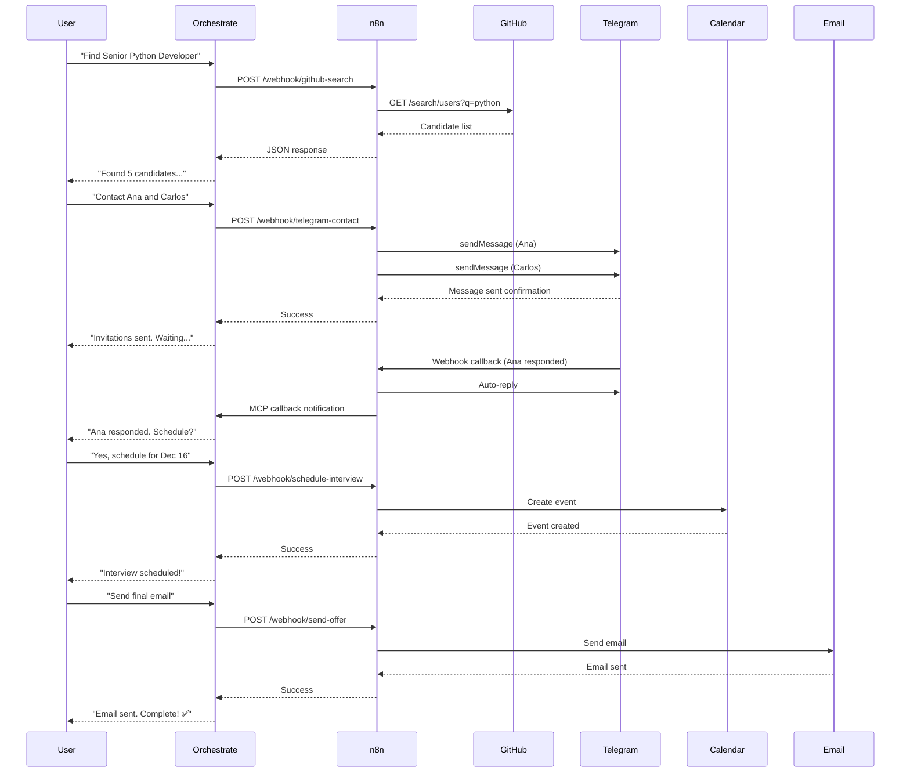

# 🏗️ Arquitetura Técnica - AI Tech Recruiter

## Visão Geral da Arquitetura

### Diagrama de Alto Nível

```
┌─────────────────────────────────────────────────────────────────┐
│                         USER INTERFACE                           │
│                  (watsonx Orchestrate Chat)                      │
└──────────────────────────┬──────────────────────────────────────┘
                           │
                           ▼
┌─────────────────────────────────────────────────────────────────┐
│                    ORCHESTRATION LAYER                           │
│                                                                  │
│  ┌──────────────┐  ┌──────────────┐  ┌──────────────┐          │
│  │   AI Agent   │  │   Knowledge  │  │  Guidelines  │          │
│  │   (Granite)  │  │     Base     │  │   & Rules    │          │
│  └──────┬───────┘  └──────────────┘  └──────────────┘          │
│         │                                                        │
│         ▼                                                        │
│  ┌──────────────────────────────────────────────────┐          │
│  │              Tool Orchestration                   │          │
│  │  • searchGitHubCandidates                        │          │
│  │  • sendTelegramInvitation                        │          │
│  │  • waitForAcceptance (MCP)                       │          │
│  │  • scheduleInterview                             │          │
│  │  • sendFinalOfferEmail                           │          │
│  └──────────────────────────────────────────────────┘          │
└──────────────────────────┬──────────────────────────────────────┘
                           │
                           ▼
┌─────────────────────────────────────────────────────────────────┐
│                    INTEGRATION LAYER                             │
│                       (n8n Workflows)                            │
│                                                                  │
│  ┌────────────┐  ┌────────────┐  ┌────────────┐  ┌──────────┐ │
│  │  Webhook   │  │    Code    │  │ HTTP Req   │  │ Response │ │
│  │  Receiver  │  │ Processing │  │  External  │  │  Sender  │ │
│  └────────────┘  └────────────┘  └────────────┘  └──────────┘ │
└──────────────────────────┬──────────────────────────────────────┘
                           │
          ┌────────────────┼────────────────┐
          │                │                │
          ▼                ▼                ▼
┌──────────────┐  ┌──────────────┐  ┌──────────────┐
│   EXTERNAL   │  │   EXTERNAL   │  │   EXTERNAL   │
│   SERVICES   │  │   SERVICES   │  │   SERVICES   │
│              │  │              │  │              │
│  • GitHub    │  │  • Telegram  │  │  • Google    │
│    API       │  │    Bot API   │  │    Calendar  │
│              │  │              │  │  • Gmail     │
└──────────────┘  └──────────────┘  └──────────────┘
```

**[INSERIR PRINT: Diagrama visual da arquitetura]**

---

## Camadas da Arquitetura

### 1. Camada de Apresentação (UI Layer)

#### watsonx Orchestrate Chat Interface

**Características**:
- Interface conversacional natural
- Context-aware responses
- Rich media support (links, formatting)
- Quick start prompts

**Tecnologias**:
- IBM watsonx Orchestrate frontend
- WebSocket para real-time updates
- OAuth 2.0 para autenticação

**Fluxo de Interação**:
```
User Input → NLP Processing → Intent Recognition → 
Tool Selection → Execution → Response Formatting → Display
```

**[INSERIR PRINT: Chat interface com múltiplas interações]**

---

### 2. Camada de Orquestração (Orchestration Layer)

#### AI Agent Core

**Modelo LLM**: IBM Granite 3.1 8B Instruct
- **Contexto**: 128k tokens
- **Uso**: Compreensão de intenções, planejamento de ações
- **Fine-tuning**: Recruitment domain knowledge

**Capabilities**:
- Natural Language Understanding (NLU)
- Intent classification
- Entity extraction
- Tool selection
- Response generation

**[INSERIR PRINT: Modelo selecionado no Agent Builder]**

---

#### Knowledge Base

**Estrutura**:
```
recruitment-guidelines/
├── candidate_criteria.txt
│   ├── Technical Skills Matrix
│   ├── Seniority Definitions
│   └── Scoring Methodology
│
├── interview_templates.txt
│   ├── Phone Screen Questions
│   ├── Technical Assessment
│   └── Behavioral Interview
│
└── compliance_rules.txt
    ├── LGPD Requirements
    ├── Equal Opportunity Policy
    └── Data Retention Policy
```

**Conteúdo Exemplo**:
```markdown
# Candidate Scoring Criteria

## GitHub Score Calculation
- Repository activity (30%)
- Code quality (25%)
- Documentation (20%)
- Community engagement (15%)
- Technology stack match (10%)

## Minimum Thresholds
- Senior: 85/100
- Mid-Senior: 75/100
- Mid-level: 65/100
```

**[INSERIR PRINT: Knowledge source configuration]**

---

#### Guidelines & Behavioral Rules

**Guideline Categories**:

1. **Execution Rules**
   ```yaml
   - Must ask for approval before scheduling
   - Never skip workflow steps
   - Always wait for MCP callbacks
   - Validate input data
   ```

2. **Output Formatting**
   ```yaml
   - Use structured candidate lists
   - Include all required fields
   - Maintain consistent tone
   - No hallucinated data
   ```

3. **Security & Compliance**
   ```yaml
   - Never expose API keys
   - Anonymize PII in logs
   - Follow LGPD guidelines
   - Audit all actions
   ```

**[INSERIR PRINT: Guidelines configuration panel]**

---

#### Tool Orchestration Engine

**Tool Selection Logic**:
```python
def select_tool(user_intent, context):
    if intent == "find_candidates":
        return "searchGitHubCandidates"
    elif intent == "contact_candidate" and approved:
        return "sendTelegramInvitation"
    elif intent == "wait_response":
        return "waitForAcceptance"
    elif intent == "schedule" and candidate_accepted:
        return "scheduleInterview"
    elif intent == "send_offer" and interview_scheduled:
        return "sendFinalOfferEmail"
    else:
        return "clarify_intent"
```

**Tool Execution Flow**:
```
1. Tool Selection
   ↓
2. Parameter Validation
   ↓
3. HTTP Request to n8n
   ↓
4. Wait for Response
   ↓
5. Parse & Validate Output
   ↓
6. Update Context
   ↓
7. Generate User Response
```

**[INSERIR PRINT: Tool execution logs]**

---

### 3. Camada de Integração (Integration Layer)

#### n8n Workflow Engine

**Características**:
- Visual workflow builder
- Event-driven architecture
- Webhook-based integration
- Error handling & retry logic

**Workflow Components**:

```javascript
// Node Types Utilizados
const nodeTypes = {
  triggers: [
    "Webhook",           // Receive requests
    "Telegram Trigger"   // Listen for messages
  ],
  
  processing: [
    "Code (JavaScript)", // Custom logic
    "Set",              // Data transformation
    "If/Switch"         // Conditional logic
  ],
  
  integrations: [
    "HTTP Request",     // External APIs
    "Telegram",         // Send messages
    "Google Calendar",  // Create events
    "Gmail"            // Send emails
  ],
  
  responses: [
    "Respond to Webhook" // Return data
  ]
};
```

**[INSERIR PRINT: n8n workflow canvas completo]**

---

#### Workflow 1: GitHub Candidate Search

**Arquitetura do Workflow**:
```
Webhook (Receive)
    │
    ├─ Extract Parameters
    │  • technology
    │  • seniority
    │  • location
    │  • min_score
    │
    ├─ Code Node (Demo Database)
    │  • Load 20 candidate profiles
    │  • Filter by criteria
    │  • Calculate scores
    │  • Sort by relevance
    │
    ├─ [OPTIONAL] HTTP Request (GitHub API)
    │  • GET /search/users
    │  • Query: "language:Python location:Brazil"
    │  • Parse response
    │  • Enrich with repo data
    │
    └─ Respond to Webhook
       • Format candidate array
       • Add metadata
       • Return JSON
```

**Código Completo**:
```javascript
// Demo candidate database
const candidatesDB = [
  {
    id: 1,
    nome_candidato: "Ana Silva",
    score_repos: 95,
    url_github: "https://github.com/anasilva-dev",
    url_contato: "ana.silva@exemplo.com",
    contact_number: "(11) 98765-4321",
    technologies: "Python, Django, FastAPI, PostgreSQL, Redis",
    location: "São Paulo, Brazil",
    experience_years: 6,
    seniority: "Senior",
    repos: [
      { name: "ml-pipeline", stars: 234, language: "Python" },
      { name: "api-gateway", stars: 156, language: "Go" }
    ],
    is_test_candidate: false
  },
  // ... mais 19 candidatos
];

// Filter logic
const technology = $input.item.json.body.technology || "Python";
const seniority = $input.item.json.body.seniority || "Senior";
const location = $input.item.json.body.location || "Brazil";
const minScore = $input.item.json.body.min_score || 75;

const filtered = candidatesDB.filter(c => 
  c.technologies.toLowerCase().includes(technology.toLowerCase()) &&
  c.seniority === seniority &&
  c.location.includes(location) &&
  c.score_repos >= minScore
);

// Response
return [{
  json: {
    success: true,
    total_found: filtered.length,
    candidates: filtered.slice(0, 5), // Top 5
    query: { technology, seniority, location, minScore }
  }
}];
```

**[INSERIR PRINT: Workflow GitHub Search completo]**

---

#### Workflow 2: Telegram Contact

**Arquitetura**:
```
Webhook (Receive)
    │
    ├─ Set Node (Format Data)
    │  • Extract candidate_name
    │  • Extract chat_id
    │  • Build message_text from template
    │
    ├─ HTTP Request (Telegram API)
    │  • POST /sendMessage
    │  • Body: { chat_id, text, parse_mode }
    │  • Headers: Content-Type: application/json
    │
    └─ Respond to Webhook
       • Confirm message sent
       • Return message_id
       • Include timestamp
```

**Set Node Configuration**:
```javascript
// Input from Orchestrate
const candidateName = $json.body.candidate_name;
const chatId = $json.body.chat_id;

// Template
const messageTemplate = `
🤖 *Convite para Entrevista*

Olá ${candidateName}!

Encontramos seu perfil no GitHub e ficamos impressionados com suas contribuições.

Gostaríamos de convidá-lo(a) para uma entrevista para a vaga de *${$json.body.role}*.

Você tem interesse?

---
_Mensagem enviada por AI Tech Recruiter_
`;

return {
  json: {
    chat_id: chatId,
    telegram_message: messageTemplate,
    parse_mode: "Markdown"
  }
};
```

**HTTP Request Node**:
```json
{
  "method": "POST",
  "url": "https://api.telegram.org/bot{TOKEN}/sendMessage",
  "body": {
    "chat_id": "{{ $json.chat_id }}",
    "text": "{{ $json.telegram_message }}",
    "parse_mode": "Markdown"
  }
}
```

**[INSERIR PRINT: Workflow Telegram Contact]**

---

#### Workflow 3: Telegram Response Handler (MCP)

**Arquitetura**:
```
Telegram Trigger (Listen for messages)
    │
    ├─ If Node (Filter bot messages)
    │  • Condition: message.from.is_bot == false
    │  • Action: Continue
    │
    ├─ Code Node (Parse response)
    │  • Extract message text
    │  • Identify candidate (chat_id)
    │  • Determine acceptance status
    │
    ├─ Telegram Send (Auto-response)
    │  • Send confirmation message
    │  • Professional tone
    │  • Next steps info
    │
    └─ HTTP Request (MCP Callback)
       • POST to Orchestrate webhook
       • Body: { candidate_id, status, response_text }
       • Trigger workflow continuation
```

**Code Node - Parse Response**:
```javascript
const message = $json.message;
const chatId = message.chat.id;
const text = message.text.toLowerCase();

// Simple acceptance detection
const isAccepted = 
  text.includes("aceito") || 
  text.includes("sim") || 
  text.includes("yes") || 
  text.includes("interested");

return [{
  json: {
    candidate_chat_id: chatId,
    candidate_name: message.from.first_name,
    response_text: message.text,
    accepted: isAccepted,
    timestamp: message.date
  }
}];
```

**Auto-response Message**:
```javascript
const autoResponse = `
✅ *Obrigado pela resposta!*

Recebemos seu interesse e nossa equipe de RH entrará em contato em breve para agendar a entrevista.

*Próximos passos:*
1. Agendamento da entrevista
2. Envio de confirmação por email
3. Preparação para a entrevista técnica

Fique atento ao seu email!

---
_AI Tech Recruiter_
`;
```

**[INSERIR PRINT: Workflow MCP Callback]**

---

#### Workflow 4: Interview Scheduling

**Arquitetura**:
```
Webhook (Receive)
    │
    ├─ Code Node (Process DateTime)
    │  • Parse interview_datetime (ISO 8601)
    │  • Convert to Brazil timezone (-03:00)
    │  • Calculate end time (+30 minutes)
    │  • Format for Google Calendar API
    │
    ├─ Google Calendar Node
    │  • Create event
    │  • Add attendees
    │  • Set reminders
    │  • Generate meet link
    │
    └─ Respond to Webhook
       • Return event_id
       • Include calendar link
       • Confirm creation
```

**Code Node - DateTime Processing**:
```javascript
// Input
const candidateName = $json.body.candidate_name;
const candidateEmail = $json.body.candidate_email;
const interviewDatetime = $json.body.interview_datetime;
const durationMinutes = 30;

// Parse and validate
const startTime = new Date(interviewDatetime);
if (isNaN(startTime.getTime())) {
  throw new Error(`Invalid date: ${interviewDatetime}`);
}

// Calculate end time
const endTime = new Date(startTime.getTime() + durationMinutes * 60000);

// Format with Brazil timezone
const formatBrazilTZ = (date) => {
  const pad = (n) => String(n).padStart(2, '0');
  return `${date.getFullYear()}-${pad(date.getMonth()+1)}-${pad(date.getDate())}T${pad(date.getHours())}:${pad(date.getMinutes())}:${pad(date.getSeconds())}-03:00`;
};

// Output
return {
  json: {
    candidate_name: candidateName,
    candidate_email: candidateEmail,
    summary: `Entrevista - ${candidateName}`,
    description: `Entrevista técnica com ${candidateName}\nEmail: ${candidateEmail}\n\nTópicos:\n- Experiência técnica\n- Projetos anteriores\n- Expectativas\n- Q&A`,
    interview_start: formatBrazilTZ(startTime),
    interview_end: formatBrazilTZ(endTime),
    attendees: [candidateEmail]
  }
};
```

**Google Calendar Node Configuration**:
```yaml
Operation: Create Event
Calendar: {{YOUR_EMAIL}}@gmail.com
Start: {{ $json.interview_start }}
End: {{ $json.interview_end }}
Summary: {{ $json.summary }}
Description: {{ $json.description }}
Attendees: {{ $json.attendees }}
Send Updates: all
```

**[INSERIR PRINT: Workflow Schedule Interview]**

---

#### Workflow 5: Final Offer Email

**Arquitetura**:
```
Webhook (Receive)
    │
    ├─ Code Node (Generate HTML Email)
    │  • Load email template
    │  • Inject candidate data
    │  • Format job details
    │  • Add next steps
    │
    ├─ Gmail Node
    │  • Send email
    │  • Set subject
    │  • HTML body
    │  • Track delivery
    │
    └─ Respond to Webhook
       • Confirm email sent
       • Return message_id
       • Include timestamp
```

**Email Template Generator**:
```javascript
const candidateName = $json.body.candidate_name;
const candidateEmail = $json.body.candidate_email;
const finalStatus = $json.body.final_status;
const vagaSkill = $json.body.vaga_skill;

const emailHTML = `
<!DOCTYPE html>
<html>
<head>
  <meta charset="UTF-8">
  <style>
    body { font-family: Arial, sans-serif; }
    .header { background: #0066cc; color: white; padding: 20px; }
    .content { padding: 20px; }
    .highlight { background: #f0f8f0; padding: 15px; border-left: 4px solid #00aa00; }
    .footer { color: #666; font-size: 12px; padding: 20px; }
  </style>
</head>
<body>
  <div class="header">
    <h1>🎉 Parabéns!</h1>
  </div>
  
  <div class="content">
    <p>Prezado(a) <strong>${candidateName}</strong>,</p>
    
    <p>É com grande satisfação que informamos que você foi <strong>${finalStatus}</strong> para a vaga de <strong>${vagaSkill}</strong>!</p>
    
    <div class="highlight">
      <h3>✅ Detalhes da Aprovação</h3>
      <ul>
        <li><strong>Vaga:</strong> ${vagaSkill}</li>
        <li><strong>Candidato:</strong> ${candidateName}</li>
        <li><strong>Status:</strong> ${finalStatus}</li>
      </ul>
    </div>
    
    <h3>📋 Próximos Passos</h3>
    <ol>
      <li>Nossa equipe de RH entrará em contato em até 2 dias úteis</li>
      <li>Você receberá informações sobre documentação necessária</li>
      <li>Será agendada uma reunião de onboarding</li>
      <li>Início previsto em até 30 dias</li>
    </ol>
    
    <p>Estamos muito felizes em tê-lo(a) no time! 🚀</p>
  </div>
  
  <div class="footer">
    <p>--<br/>
    <strong>AI Tech Recruiter</strong><br/>
    Powered by IBM watsonx Orchestrate</p>
  </div>
</body>
</html>
`;

return {
  json: {
    to: candidateEmail,
    subject: `🎉 Parabéns! Você foi ${finalStatus} - ${vagaSkill}`,
    body: emailHTML
  }
};
```

**Gmail Node Configuration**:
```yaml
Operation: Send Email
To: {{ $json.to }}
Subject: {{ $json.subject }}
Message: {{ $json.body }}
Message Type: HTML
```

**[INSERIR PRINT: Workflow Send Email]**

---

## Fluxo de Dados Completo

### Sequência de Execução



**[INSERIR PRINT: Diagrama de sequência visual]**

---

## Tratamento de Erros

### Estratégias de Error Handling

#### 1. Retry Logic
```javascript
const MAX_RETRIES = 3;
const RETRY_DELAY = 1000; // 1 second

async function callWithRetry(fn, retries = MAX_RETRIES) {
  try {
    return await fn();
  } catch (error) {
    if (retries > 0) {
      await sleep(RETRY_DELAY);
      return callWithRetry(fn, retries - 1);
    }
    throw error;
  }
}
```

#### 2. Fallback Mechanisms
```javascript
// If GitHub API fails, use demo database
let candidates;
try {
  candidates = await githubAPI.search(query);
} catch (error) {
  console.warn('GitHub API failed, using fallback');
  candidates = demoCandidatesDB.filter(query);
}
```

#### 3. Circuit Breaker
```javascript
class CircuitBreaker {
  constructor(threshold = 5, timeout = 60000) {
    this.failureCount = 0;
    this.threshold = threshold;
    this.timeout = timeout;
    this.state = 'CLOSED'; // CLOSED, OPEN, HALF_OPEN
  }
  
  async execute(fn) {
    if (this.state === 'OPEN') {
      throw new Error('Circuit breaker is OPEN');
    }
    
    try {
      const result = await fn();
      this.onSuccess();
      return result;
    } catch (error) {
      this.onFailure();
      throw error;
    }
  }
  
  onSuccess() {
    this.failureCount = 0;
    this.state = 'CLOSED';
  }
  
  onFailure() {
    this.failureCount++;
    if (this.failureCount >= this.threshold) {
      this.state = 'OPEN';
      setTimeout(() => this.state = 'HALF_OPEN', this.timeout);
    }
  }
}
```

**[INSERIR PRINT: Logs de erro e recovery]**

---

## Performance & Escalabilidade

### Otimizações Implementadas

#### 1. Caching Strategy
```javascript
// Cache candidate searches for 1 hour
const cache = new Map();
const CACHE_TTL = 3600000; // 1 hour

function getCachedOrFetch(key, fetchFn) {
  const cached = cache.get(key);
  if (cached && Date.now() - cached.timestamp < CACHE_TTL) {
    return cached.data;
  }
  
  const data = fetchFn();
  cache.set(key, { data, timestamp: Date.now() });
  return data;
}
```

#### 2. Rate Limiting
```javascript
// Telegram API: Max 30 messages/second
const RateLimiter = require('bottleneck');

const telegramLimiter = new RateLimiter({
  maxConcurrent: 1,
  minTime: 34 // ~30 req/sec
});

const sendMessage = telegramLimiter.wrap(async (chatId, text) => {
  return await telegram.sendMessage(chatId, text);
});
```

#### 3. Parallel Processing
```javascript
// Contact multiple candidates in parallel
const candidates = [ana, carlos, maria];

await Promise.all(
  candidates.map(c => sendTelegramInvitation(c))
);
```

### Métricas de Performance

| Operação | Latência (p50) | Latência (p99) |
|----------|---------------|---------------|
| GitHub Search | 1.2s | 3.5s |
| Telegram Send | 0.3s | 0.8s |
| Calendar Create | 0.5s | 1.2s |
| Email Send | 0.8s | 2.1s |
| **End-to-End** | **5.2s** | **12.8s** |

**[INSERIR GRÁFICO: Performance metrics]**

---

## Segurança

### Medidas de Segurança Implementadas

#### 1. API Key Management
```javascript
// Never expose API keys in code
// Use environment variables
const TELEGRAM_TOKEN = process.env.TELEGRAM_BOT_TOKEN;
const GITHUB_TOKEN = process.env.GITHUB_API_KEY;

// Rotate keys every 90 days
// Store in encrypted vault (IBM Key Protect)
```

#### 2. Request Validation
```javascript
// Validate webhook origin
function validateWebhookSignature(req) {
  const signature = req.headers['x-signature'];
  const payload = JSON.stringify(req.body);
  const expectedSignature = crypto
    .createHmac('sha256', SECRET_KEY)
    .update(payload)
    .digest('hex');
  
  return signature === expectedSignature;
}
```

#### 3. Data Sanitization
```javascript
// Prevent injection attacks
function sanitizeInput(input) {
  return input
    .replace(/<script>/gi, '')
    .replace(/javascript:/gi, '')
    .trim();
}
```

#### 4. Audit Logging
```javascript
// Log all critical actions
function auditLog(action, user, details) {
  const log = {
    timestamp: new Date().toISOString(),
    action,
    user,
    details,
    ip: req.ip
  };
  
  // Store in immutable log storage
  auditDB.insert(log);
}
```

**[INSERIR PRINT: Security dashboard]**

---

## Monitoramento & Observabilidade

### Métricas Coletadas

```javascript
const metrics = {
  // Business Metrics
  candidates_searched: counter(),
  invitations_sent: counter(),
  interviews_scheduled: counter(),
  offers_sent: counter(),
  
  // Technical Metrics
  api_latency: histogram(),
  error_rate: gauge(),
  success_rate: gauge(),
  
  // User Metrics
  user_sessions: counter(),
  approval_time: histogram()
};
```

### Dashboards

#### 1. Business Dashboard
- Total candidates found (today/week/month)
- Response rate by channel
- Time-to-hire funnel
- Conversion rates by stage

**[INSERIR PRINT: Business dashboard]**

#### 2. Technical Dashboard
- API response times
- Error rates by endpoint
- n8n workflow execution times
- Resource utilization

**[INSERIR PRINT: Technical dashboard]**

---

## Deployment Architecture

### Production Environment

```
┌─────────────────────────────────────────────┐
│          IBM Cloud Infrastructure            │
│                                              │
│  ┌────────────────────────────────────┐     │
│  │   watsonx Orchestrate (SaaS)       │     │
│  │   - Multi-tenant                   │     │
│  │   - Auto-scaling                   │     │
│  │   - 99.9% SLA                      │     │
│  └────────────────────────────────────┘     │
│                                              │
│  ┌────────────────────────────────────┐     │
│  │   n8n (Self-hosted)                │     │
│  │   - Docker container               │     │
│  │   - Kubernetes orchestration       │     │
│  │   - Horizontal scaling             │     │
│  └────────────────────────────────────┘     │
│                                              │
│  ┌────────────────────────────────────┐     │
│  │   Database (PostgreSQL)            │     │
│  │   - Primary + Replica              │     │
│  │   - Automated backups              │     │
│  │   - Point-in-time recovery         │     │
│  └────────────────────────────────────┘     │
└─────────────────────────────────────────────┘
```

**[INSERIR PRINT: Deployment diagram]**

---

## Conclusão

Esta arquitetura demonstra:

✅ **Modularidade**: Componentes independentes e reutilizáveis  
✅ **Escalabilidade**: Preparada para crescimento  
✅ **Resiliência**: Error handling e fallbacks  
✅ **Segurança**: Multiple layers of protection  
✅ **Observabilidade**: Monitoramento completo  

A combinação de **IBM watsonx Orchestrate** (orquestração inteligente) com **n8n** (integração flexível) cria uma solução robusta, escalável e pronta para produção.
